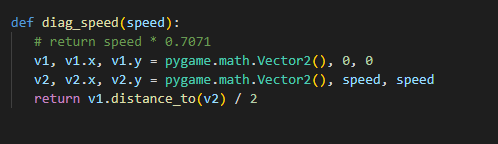

<!--

Writing Guidelines
https://docs.github.com/en/get-started/writing-on-github/getting-started-with-writing-and-formatting-on-github/basic-writing-and-formatting-syntax

“The code is more what you’d call ‘guidelines’ than actual rules.”
– Barbossa, Pirates of the Caribbean

-->

# Survival Squared
## Video Demo:  <URL HERE>
## Description:

 

## What will your software do? What features will it have? How will it be executed?
 

I'm thinking about designing a small video game. A little wave survival where you start with a dot and get weapons, which you will use to kill the dangerous squares who are coming to get you.

 

#### Features needed:

- Player dot with WASD movements and mouse for aiming
- A timer and wave counter
- Enemy squares who will kill the player if they touch them
- Kill counter
- Leaderboard of attempts
- Scaling difficulty with waves

## What new skills will you need to acquire? What topics will you need to research?
 

I'm gonna need to research a python package to make the graphics and everything related to it, currently I choose pygame.

 

## What might you consider to be a good outcome for your project? A better outcome? The best outcome?
 

My best outcome is having all the features I wrote in features needed, a better one is having most of them and a good one is having a functional game otherwise, I can't submit it in whatever state it is.

 

## Timeline - 06/12/2022 to 20/12/2022 (Est. 14 days) 

### 06/12/2022

I wrote the readme until this point and messed around with pygame code, looking at the documentation, pygame tutorials and in stackoverflow when I couldn't make something work as expected.

### 07/12/2022

Today with the knowledge acquired yesterday, I wanted to make a dot which would represent the main player, and make it move, but not in a speed that was tied to framerate, I wanted to make it move at the same speed indifferently if the framerate was 60, 120 or 24. After much tinkering, I renembered reading a lot of posts about games that had their physics tied to framerate and csgo/pubg which had tick rates, which meant they would only update a certain amount of times per second.

So started accumulating the ticks in delta, and if the delta was higher then 25, which means 25 ms had passed, I would check for keyboard inputs on the WASD keys and move it accordingly with my speed variable.

Without counting the bad design which makes speed higher when going diagonally it seems to move, even if the framerate was different.

After further testing if the framerate goes low enough it will slow down, hmmmmmmm, dammit

On my quest to make it move constant with time and not framerate, I also built some debug data to help me understand.

- Current framerate(max framerate with arrows keys adjustments)
- Time to render a frame
- Dot X position
- Dot Y Position

After some research into diagonal movement I made the keyboard inputs change a list with 2 values and if the keys are the diagonal keys, I made the x and y multiplied by 0.7071, because after looking for a way to calculate the speed that I needed to go diagonally I found a calculation that was c = root(x^2 + y^2) then divided by 2 gave me the speed for x and y, then I calculated the percentage of that compared with 5 and came up with 0.7071. 

Since then I read more about vectors and found a way to calculate the distance that the previous equation gave me, then divided by two gave me the correct speed.

Speed was 5 here.

### 08/12/2022

Made class for the debug text, it's kinda bad but does the job for now 

Also made F3 show the debug info and F4 hide it.

### 09/12/2022

Made a class for the player, also made it a circle so the name of the game makes sense "Survival Squared", right now I need to make the enemies, the squares, and implement a basic hunt AI, where they come after the player, if they can reach it, player dies and "Game Over!"

After that I created a child Class of the player called Square, then gave it a random movement method.

Back in Main, I created a list of squares, made them call the random direction method once a second, and updated their movement every 25 ms like the player, here's the result

Some

5000 of them

### 11/12/2022

Today I started by doing a new method for the squares to seek the players after that worked, I created a method for collisions between squares, at first it wasn't working right, but then I made it take a list of all the squares check if it's not the same by checking coordinates, and if not change their mov vector away from the colliding square.

I was testing different squares with different speeds and different collisions, as the blue ones didnt collide but any squares that they passed by collided, so they looked like they took them along

Next up probably need to make a gun for the player, need to look into pygame.mouse and genertate bullets when player clicks mouse, that will go on the direction the mouse was in.